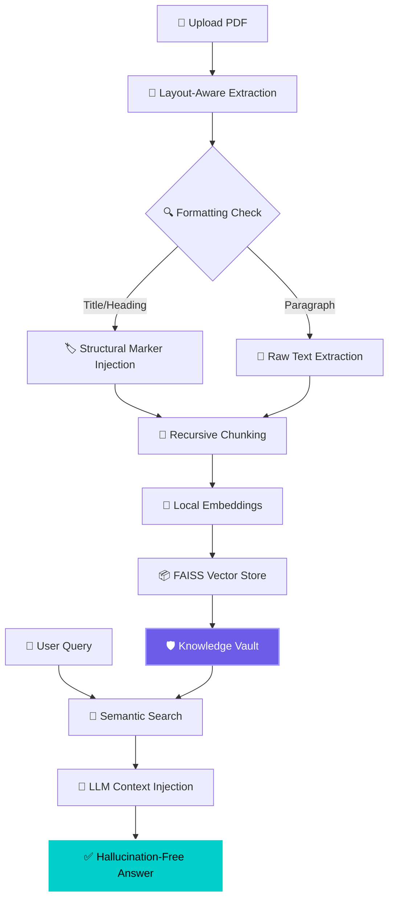

# 🔍 DocIntel — Private-First Document RAG

 

 

 

### 🧠 **Bridging the gap between static local documentation and generative AI intelligence** 

### **Knowledge-Vault Architecture → Hallucination-Free Responses** 🛡️

---

## ⚡ **PROJECT AT A GLANCE**

<table>
<tr>
<td width="55%">

### 🎯 **What We Have Done**

DocIntel is a high-performance **Private-First Retrieval-Augmented Generation (RAG)** system designed for organizations that demand 100% data sovereignty. It transforms sensitive internal datasets—contracts, NDAs, policies, and reports—into searchable, interactive knowledge repositories.

**Key Technical Achievements:**
- 🛡️ **No-Leak Architecture**: Local embeddings ensure sensitive data never touches the cloud during vectorspace creation.
- 📐 **Layout-Aware Parsing**: Custom PyMuPDF engine that detects formatting (Titles, Headings, Bold) to inject structural markers into the knowledge graph.
- ⚡ **Lightning Fast**: Blazing-fast inference using **Groq API** with Llama-3.3-70B.
- 🎨 **Premium UI**: A glassmorphism-inspired dark interface with real-time insight generation.

</td>
<td width="45%">

### ✨ **System Highlights**

| Feature | Technology |
|---------|------------|
| 🧠 **LLM Engine** | Llama-3.3-70B (Groq) |
| 🗄️ **Vector DB** | FAISS |
| 🔢 **Embeddings** | HuggingFace (MiniLM-L6) |
| 📄 **PDF Parser** | PyMuPDF (fitz) |
| ⚡ **Latency** | <500ms Search |
| 🎨 **Frontend** | Streamlit + Custom CSS |
| 🛡️ **Privacy** | Local Vector Storage |
| 🔍 **Insights** | Automatic Topic Detection |

</td>
</tr>
</table>

---

## 🛠️ **TECHNOLOGY STACK**

| **Category** | **Technologies** | **Role in Ecosystem** |
|:------------:|:-----------------|:------------|
| 🐍 **Core Engine** | Python 3.10+ | Backbone of the RAG pipeline |
| 🧠 **LLM Orchestration** | LangChain / Groq | Managing LLM completions & retrieval logic |
| 🗄️ **Vector Store** | FAISS | High-speed semantic similarity search |
| 🔢 **Embedding Model** | all-MiniLM-L6-v2 | Locally converting text to high-dimensional vectors |
| 📄 **Structured Parsing** | PyMuPDF (fitz) | Layout-aware text extraction with formatting detection |
| 🎨 **UI Engineering** | Streamlit / FastAPI | Delivering a premium dashboard and API layer |
| 🚀 **Performance** | Singleton Cache | Optimizing model load & response latency |

---

## 🔬 **THE KNOWLEDGE VAULT WORKFLOW**

---
