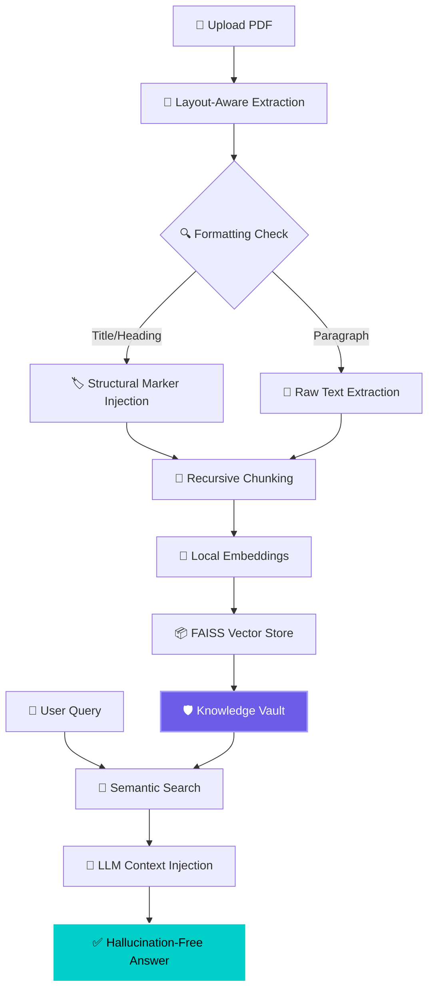

<div align="center">

# 🔍 DocIntel — Private-First Document RAG

[](https://git.io/typing-svg)


<br/>

[](https://github.com/mayank-goyal09/project-55-private-hr-rag)
[](https://github.com/mayank-goyal09/project-55-private-hr-rag)

<br/>


<br/>

### 🧠 **Bridging the gap between static local documentation and generative AI intelligence** 

### **Knowledge-Vault Architecture → Hallucination-Free Responses** 🛡️

</div>

---

## ⚡ **PROJECT AT A GLANCE**

<table>
<tr>
<td width="55%">

### 🎯 **What We Have Done**

DocIntel is a high-performance **Private-First Retrieval-Augmented Generation (RAG)** system designed for organizations that demand 100% data sovereignty. It transforms sensitive internal datasets—contracts, NDAs, policies, and reports—into searchable, interactive knowledge repositories.

**Key Technical Achievements:**
- 🛡️ **No-Leak Architecture**: Local embeddings ensure sensitive data never touches the cloud during vectorspace creation.
- 📐 **Layout-Aware Parsing**: Custom PyMuPDF engine that detects formatting (Titles, Headings, Bold) to inject structural markers into the knowledge graph.
- ⚡ **Lightning Fast**: Blazing-fast inference using **Groq API** with Llama-3.3-70B.
- 🎨 **Premium UI**: A glassmorphism-inspired dark interface with real-time insight generation.

</td>
<td width="45%">

### ✨ **System Highlights**

| Feature | Technology |
|---------|------------|
| 🧠 **LLM Engine** | Llama-3.3-70B (Groq) |
| 🗄️ **Vector DB** | FAISS |
| 🔢 **Embeddings** | HuggingFace (MiniLM-L6) |
| 📄 **PDF Parser** | PyMuPDF (fitz) |
| ⚡ **Latency** | <500ms Search |
| 🎨 **Frontend** | Streamlit + Custom CSS |
| 🛡️ **Privacy** | Local Vector Storage |
| 🔍 **Insights** | Automatic Topic Detection |

</td>
</tr>
</table>

---

## 🛠️ **TECHNOLOGY STACK**

<div align="center">


</div>

| **Category** | **Technologies** | **Role in Ecosystem** |
|:------------:|:-----------------|:------------|
| 🐍 **Core Engine** | Python 3.10+ | Backbone of the RAG pipeline |
| 🧠 **LLM Orchestration** | LangChain / Groq | Managing LLM completions & retrieval logic |
| 🗄️ **Vector Store** | FAISS | High-speed semantic similarity search |
| 🔢 **Embedding Model** | all-MiniLM-L6-v2 | Locally converting text to high-dimensional vectors |
| 📄 **Structured Parsing** | PyMuPDF (fitz) | Layout-aware text extraction with formatting detection |
| 🎨 **UI Engineering** | Streamlit / FastAPI | Delivering a premium dashboard and API layer |
| 🚀 **Performance** | Singleton Cache | Optimizing model load & response latency |

---

## 🔬 **THE KNOWLEDGE VAULT WORKFLOW**



---
## 🚧 **DIFFICULTIES WE FACED (AND SOLVED)**

### 1. 🏗️ **Semantic Context Loss**
Standard RAG pipelines treat text as a flat stream, losing the hierarchy of document headers and titles.
> **Solution**: We built a custom **Layout-Aware PDF Parser**. By inspecting font sizes and weights in real-time, we inject markers like `[TITLE]` and `[HEADING]` directly into the text chunks. This allows the LLM to understand *exactly* where a piece of info sits in the document hierarchy.

### 2. 🧊 **The "Cold Start" Latency Problem**
Loading heavy transformer models for embeddings and initiating LLM clients on every request caused 3-5 second delays.
> **Solution**: Implemented a **Singleton Model Cache**. Heavy weights are loaded ONCE at server startup (`lifespan` event) and reused across all requests, reducing per-query latency to milliseconds.

### 3. 🤥 **LLM Hallucinations**
AI models tend to "fill the gaps" when they can't find specific answers in the documentation.
> **Solution**: Tight prompt engineering with strict "Answer ONLY from context" rules. We implemented a fallback system that detects low-confidence retrieval and provides a user-friendly "Information not found" response instead of guessing.

---

## 🎨 **PREMIUM USER EXPERIENCE**

<div align="center">

### ✨ **Experience the Future of Document Analysis**

</div>

<table>
<tr>
<td width="50%">

#### 🛡️ **Sidebar Intelligence**
- **Document Center**: Multi-file management.
- **System Status**: Real-time ready/waiting indicators.
- **Dynamic Stats**: Counters for pages, chunks, and files analyzed.
- **Topic Cards**: Auto-extracted insights using LLM summarization.

</td>
<td width="50%">

#### 💬 **AI Interaction**
- **Glassmorphism Chat**: Sleeker, more readable message bubbles.
- **Source Attribution**: Every answer shows the exact source file used.
- **Latency Tracking**: Real-time response time indicators.
- **Suggestion Chips**: Quick-start prompts for common tasks.

</td>
</tr>
</table>

---

## 🚀 **QUICK START GUIDE**

### **Step 1: Clone the Repository** 📥

```bash
git clone https://github.com/mayank-goyal09/project-55-private-hr-rag.git
cd project-55-private-hr-rag
```

### **Step 2: Initialize Environment** 🔑

Create a `.env` file in the root directory:
```env
GROQ_API_KEY=your_groq_api_key_here
```

### **Step 3: Setup & Launch** 🎯

```bash
# Install dependencies
pip install -r requirements.txt

# Option A: Launch Premium Streamlit UI
streamlit run app.py

# Option B: Launch FastAPI Backend
python server.py
```

---

## 🎭 **HOW TO USE**

1. **Upload**: Drop any PDF into the **Document Center** in the sidebar.
2. **Observe**: Watch the **System Status** turn green as the document is chunked and embedded locally.
3. **Analyze**: Review the **Key Topics Detected** cards to understand what the AI has indexed.
4. **Query**: Ask specific questions in the chat—from "What is the policy on overtime?" to "Find the deadline in this contract."
5. **Verify**: Check the **Source Tag** below each response to see exactly where the information came from.

---

## 👨‍💻 **CONNECT WITH ME**

<div align="center">

[](https://github.com/mayank-goyal09)
[](https://www.linkedin.com/in/mayank-goyal-4b8756363/)
[](https://mayank-portfolio-delta.vercel.app/)

<br/>

**Mayank Goyal**  
📊 AI Engineer | 🧠 RAG Architect | 🐍 Python Developer  
*"Turning static data into living intelligence."* 🔍✨

<br/>


</div>
